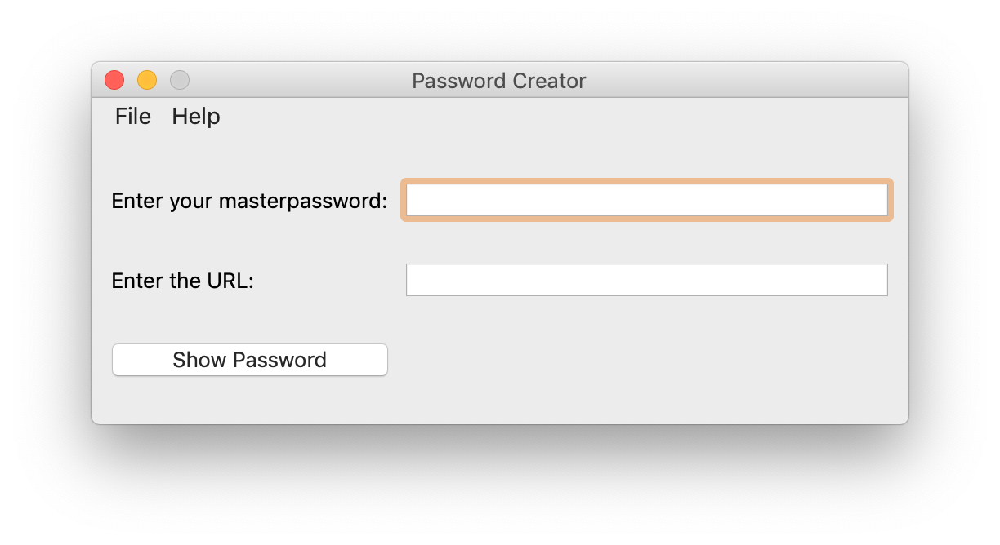

# password_creator

Use this program to calculate a password from masterpasswords and domains using [pbkdf2](https://docs.python.org/3/library/hashlib.html#key-derivation). This program is inspired by the [ctSESAM-python](https://github.com/pinae/ctSESAM-python).

## Requirements

* Python 3.6+
* PyQt5 (`pip3 install PyQt5`)

## Howto

Start the program with

    ./password_creator

on UNIX-like systems or

    python password_creator.py

on Windows 10.

Enter a masterpassword and an URL. With these input values the app is creating a password using `pbkdf2_hmac`, an implementation of the *pbkdf2* key derivation function using *hmac* as pseudorandom function. The `pbkdf2_hmac` method can be found in the `hashlib` library. The *salt* is hard coded in the "create_password.py" file. Search for `salt='pepper'` and change "pepper" with a string of your choice.

## Changelog

* 19.08.2019: First commit
